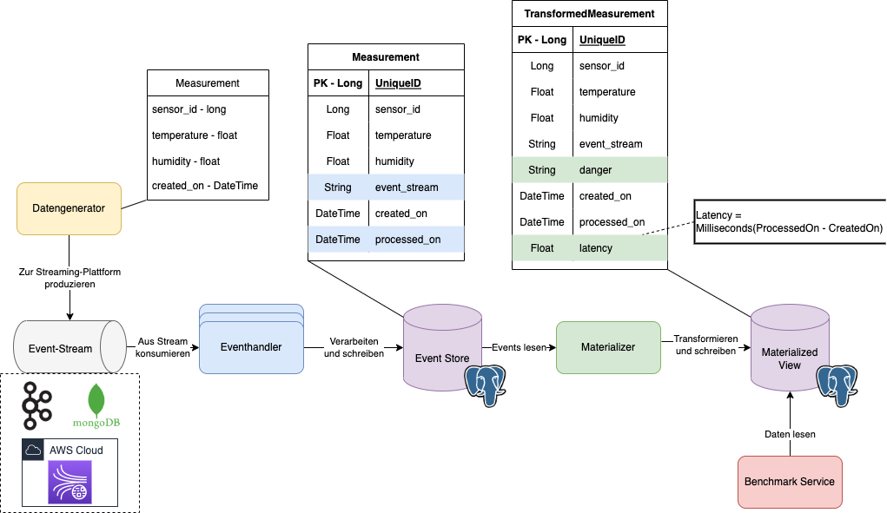

# ESC-Streaming-Architectures-Thesis-Benchmark
The benchmark part of the architecture from my thesis for Streaming Architectures developed in Python,
to evaluate the streaming system.

The other projects and parts are:
- [1Zero64/ESC-Streaming-Architectures-Thesis](https://github.com/1Zero64/ESC-Streaming-Architectures-Thesis) developed in Java
- [1Zero64/ESC-Streaming-Architectures-Thesis-Materializer](https://github.com/1Zero64/ESC-Streaming-Architectures-Thesis-Materializer) developed in Go

To successfully run the Benchmark Service you first need to install the required libraries and packages.
For that a requirements text file was created with all the required libraries and packages.
To install them run the following command:
```bash
pip install -r requirements.txt
# Or (in my case)
pip3 install -r requirements.txt 
```

After installing, you can now run the wished Python scripts by using a "python3 ..." or "python ..." command with the
path to the wished .py script or by the IDE.
```bash
# Example
python3 benchmark/throughput.py
```

## Troubleshooting
Sometimes problems might occur when installing the libraries and packages, mainly because of dotenv and pyscop.
To repair it run the following commands:
```bash
pip install psycopg2-binary
# Or
pip3 install psycopg2-binary
```

Sometimes problems occur when installing the libraries and packages.
```bash
pip install python-dotenv
# Or
pip3 install python-dotenv
```

## The architecture
